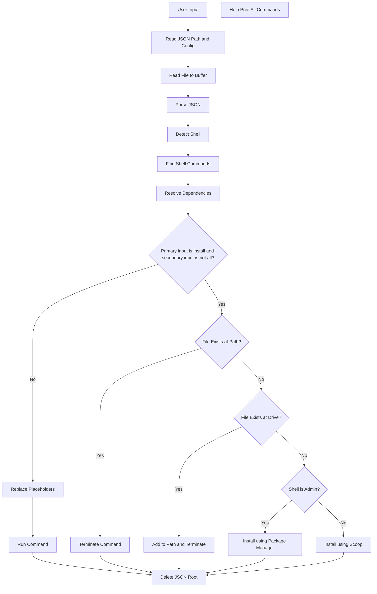

# DevCLI

A lightweight cross-shell CLI tool (CMD, PowerShell, Linux) for automating developer tasks. No admin access required. Built in C with minimal dependencies (`cJSON`, and shell-specific package managers).

---

## Resource Download

### cJSON Library

- `cJSON.h` and `cJSON.c` files are included in the repository and will be cloned automatically.

---

### Non-Admin Shell Setup (e.g., PowerShell on VS Code)

1. **Confirm Shell Type:**

   - **PowerShell:**
     ```powershell
     $IsAdmin = ([Security.Principal.WindowsPrincipal] [Security.Principal.WindowsIdentity]::GetCurrent()).IsInRole([Security.Principal.WindowsBuiltInRole] "Administrator")
     ```
     - If the command returns `$false`, you are on a **non-admin shell**.

   - **CMD:**
     ```cmd
     net session >nul 2>&1
     if %errorlevel% == 0 (
         echo Admin
     ) else (
         echo Non-Admin
     )
     ```

   - **Linux:**
     Most tools are preinstalled on Debian-based systems. If not, use APT:
     ```sh
     sudo apt update
     sudo apt install build-essential git
     ```

2. **Install Scoop:**

   - **PowerShell:**
     ```powershell
     iwr -useb get.scoop.sh | iex
     ```

   - **CMD:**
     Open PowerShell manually and run the above command. Scoop setup doesn’t work directly in CMD.

3. **Verify Installation:**

   - Run:
     ```sh
     scoop --version
     ```

---

### Admin Shell Setup (Using Chocolatey)

1. **Confirm Shell Type:**

   - Use the same detection commands as above. If PowerShell returns `$true` or CMD outputs `Admin`, you’re on an **admin shell**.

2. **Install Chocolatey:**

   - **PowerShell (Admin):**
     ```powershell
     Set-ExecutionPolicy Bypass -Scope Process -Force; 
     [System.Net.ServicePointManager]::SecurityProtocol = 
     [System.Net.ServicePointManager]::SecurityProtocol -bor 3072; 
     iex ((New-Object System.Net.WebClient).DownloadString('https://community.chocolatey.org/install.ps1'))
     ```

   - **CMD:**
     Open PowerShell manually and run the above command, as Chocolatey setup doesn’t work directly in CMD.

3. **Verify Installation:**

   - Run:
     ```sh
     choco --version
     ```

---

## Features

- Task automation via JSON config  
- Cross-platform support (CMD, PowerShell, Linux Shell)  
- Dependency resolution  
- Before installing a tool, it checks if the tool is already present in PATH or installed on the system (drive).
  If found on disk but not in PATH, it temporarily adds it to PATH.  
- Logging and shell detection  
- Fast and portable  

---

## Usage

1. **Build from Source**

> No prebuilt `.exe` or binary is provided to avoid security warnings. You must compile the tool manually using GCC (or any C compiler) as shown below. Ensure `gcc` is available in your PATH (from MinGW or similar compiler toolchains).

- Windows (CMD / PowerShell):
  ```sh
  gcc main.c cJSON.c -o devcli.exe
  ```
- Linux(Bash/Zsh):
  ```sh
  gcc main.c cJSON.c -o devcli
  chmod +x devcli
  ```
2. **Set Environment Path:**

   Add the path of the cloned folder to your system’s environment variables so you can run `devcli` from anywhere.

  - On Windows:  
    Use *System Properties → Environment Variables → PATH → Edit*  
  - On Linux:  
    Add this line to `.bashrc` or `.zshrc`:  
    ```sh
    export PATH="$PATH:/path/to/devcli"
    ```

3. **Configure Tasks:**

   Edit `tasks.json` to customize commands.  
   Make sure you understand its structure to define your own automations.

---

## Files Overview

- `main.c`- Main source code  
- `tasks.json` - Task configuration file  
- `cJSON.c` & `cJSON.h` - JSON parser library   

---

## High Level Diagram



## Developer Documentation (LLD)

A detailed low-level design (LLD) document generated using Doxygen is available:

[View LLD Documentation](https://riddhima04022006.github.io/devcli/)

This document includes:
- Internal architecture details
- Function-level explanations
- Dependency resolution logic
- Shell detection and command execution flow

## License

MIT License - see [LICENSE](./LICENSE) for details.
